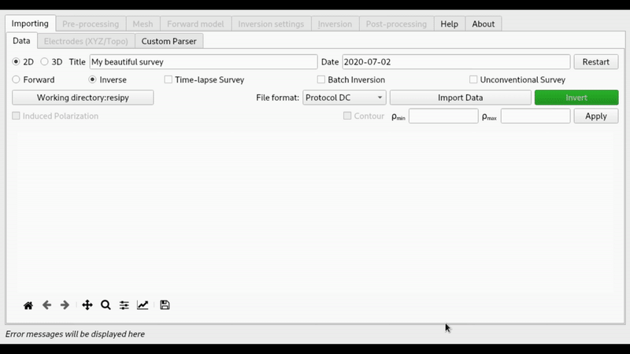
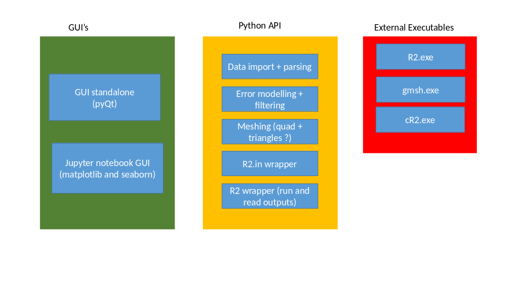

GUI for R* family of codes (R2, cR2, R3t, cR3t)
===============================================

ResIPy is a Python wrapper around the [R* family of codes](http://www.es.lancs.ac.uk/people/amb/Freeware/R2/R2.htm) (for 2D/3D DC/IP inversion).
ResIPy provides a standalone graphical user interface (GUI) along with a Python API (Application Programming Interface)
for use in Jupyter notebook. Have a look at the [**documentation and the examples**](https://hkex.gitlab.io/resipy) or subscribe to our [**YouTube channel (ResIPy)**](https://www.youtube.com/channel/UCkg2drwtfaVAo_Tuyeg_z5Q) to learn more.

ResIPy aims to be 
- (1) **Simple and intuitive** to use (you can invert your data in one-click with all default settings)
- (2) But still allowing the user to have **full control** on data filtering, error modelling, mesh parameters and inversion settings

Downloads
---------
Version 3.5.4:
<br>
[](https://github.com/hkexgroup/resipy/releases/download/v3.5.4/ResIPy-windows.exe)
[](https://github.com/hkexgroup/resipy/releases/download/v3.5.4/ResIPy-macos.dmg "wine is required - see below")
[](https://github.com/hkexgroup/resipy/releases/download/v3.5.4/ResIPy-linux)
<br>
macOS Mojave and before: [](https://github.com/hkexgroup/resipy/releases/download/v3.4.5/ResIPy-macos_mojave.dmg "wine is required - see below")

Note for Windows users:
- If your Windows prevents you from running ResIPy on first run, on the “Windows protected your PC” message, click on “More info” and then click on “Run anyway” from the bottom. You may also allow ResIPy to run from your antivirus program. 

Notes for Mac and Linux users:
- You will need to have [*wine*](https://www.winehq.org/) installed as the executables beneath are compiled for Windows (detailed instruction [below](https://gitlab.com/hkex/resipy#wine-installation-linux-and-mac-users)).
- On MacOS: If you get "ResIPy is damaged" or "ResIPy cannot be opened" error, run this command in terminal `xattr -cr /Applications/ResIPy.app`
- On Linux: If you get "command not found" error, you might need to allow "executable permission" to the binary, using `sudo chmod 775 ResIPy`

Zip files:<br>
[-blue.svg?style=flat&logo=Microsoft&logoColor=white)](https://github.com/hkexgroup/resipy/releases/download/v3.5.4/ResIPy-windows.zip)
[-lightgrey.svg?style=flat&logo=Apple&logoColor=white)](https://github.com/hkexgroup/resipy/releases/download/v3.5.4/ResIPy-macos.zip "wine is required - see below")
[-orange.svg?style=flat&logo=Linux&logoColor=white)](https://github.com/hkexgroup/resipy/releases/download/v3.5.3/ResIPy-linux.zip)<br>
macOS Mojave and before: [-lightgrey.svg?style=flat&logo=Apple&logoColor=white)](https://github.com/hkexgroup/resipy/releases/download/v3.4.5/ResIPy-macos_mojave.zip "wine is required - see below")


What it can do
--------------



Project structure
-----------------


General overlook of the project structure with the three main parts.   
Don't hesitate to consult the [CONTRIBUTING.md](./CONTRIBUTING.md) for more informations.   
The full description of the API can be found in the *[documentation](https://hkex.gitlab.io/resipy/api.html)*.


Try it from source
------------------
** Note: currently only Python versions 3.6 to 3.9 are supported.

After downloading or cloning (`git clone https://gitlab.com/hkex/resipy`) the repository,
you can run the GUI using:
```sh
cd resipy/src
python ui.py
```
You can also try out the API on [](https://mybinder.org/v2/gl/hkex%2Fresipy/stable?filepath=jupyter-notebook) or using:
```sh
cd resipy/jupyter-notebook
python -m notebook # or just 'jupyter notebook'
```


Wine installation (Linux and Mac users)
-------------------
ResIPy contains executables that are built only for windows. To run them you will need to install *wine*.

### On Linux

```sh
sudo apt-get install wine-stable # if using debian/ubuntu based distribution
sudo pacman -S install wine # if using arch based distribution
```

### On Mac

**IMPORTANT NOTE**: Please try installing *wine* > v5.0.0 with below instructions first.
ResIPy cannot be run from within the dmg. You must drag it to a folder on your filesystem (e.g., Applications, Desktop).   

You first need to install ```wine``` through ```Homebrew``` to be able to run ```.exe``` files on you Mac OS X.   

Open "terminal" and install ```Homebrew``` by pasting below in your terminal:
```sh
/bin/bash -c "$(curl -fsSL https://raw.githubusercontent.com/Homebrew/install/master/install.sh)"
```
Follow the instructions. (You may need to install [Command Line Tools](http://osxdaily.com/2014/02/12/install-command-line-tools-mac-os-x/))   

Once the ```Homebrew``` installation is successfully done, install ```xquartz``` by pasting below command in terminal:
```sh
brew install xquartz
```
Then install ```wine```:

On macOS Catalina and higher (paste below in terminal):
```sh
brew install --no-quarantine wine-stable
```
On *older* macOS versions (paste below in terminal):
```sh
brew install wine
```
If all is done with no errors, you are ready to run ResIPy!

**NOTE**: The first time you're running ```wine``` (e.g., creating a triangular mesh) it will need to be updated and install a few dependencies and that will take some time.

**NOTE**: If you get "ResIPy is damaged" error, run this command in terminal `xattr -cr /Applications/ResIPy.app` (instead of "/Applications/ResIPy.app" put the address to the place you have the app).


Feature request and bug report
----
If there is a feature you would like to see in the API or the GUI or if there is a bug you want to report,
please raise an [issue on Gitlab](https://gitlab.com/hkex/resipy/issues) describing it. We need to **be able to reproduce** the issue in order to fix it, so please provide example files and error log, related to your issue.

You can also have a look at the FAQ and list of known issues on the [wiki](https://gitlab.com/hkex/resipy/-/wikis/home).

Contributing
---------
If you wish to contribute to the code, please familiarize yourself with the [guidelines](./CONTRIBUTING.md).


Citing ResIPy
------------------
If you use ResIPy for you work, please cite [this paper](https://www.sciencedirect.com/science/article/pii/S0098300419308192?via%3Dihub#appsec4) as:

    Blanchy G., Saneiyan S., Boyd J., McLachlan P. and Binley A. 2020.
    “ResIPy, an Intuitive Open Source Software for Complex Geoelectrical Inversion/Modeling.”
    Computers & Geosciences, February, 104423. https://doi.org/10.1016/j.cageo.2020.104423.

BibTex code:
```latex
@article{blanchy_resipy_2020,
	title = {{ResIPy}, an intuitive open source software for complex geoelectrical inversion/modeling},
	issn = {0098-3004},
	url = {http://www.sciencedirect.com/science/article/pii/S0098300419308192},
	doi = {10.1016/j.cageo.2020.104423},
	pages = {104423},
	journaltitle = {Computers \& Geosciences},
	author = {Blanchy, Guillaume and Saneiyan, Sina and Boyd, James and {McLachlan}, Paul and Binley, Andrew},
	urldate = {2020-02-07},
	date = {2020-02-04},
	langid = {english}
}
```


Temporary folder issue
----
Before v2.0.0 (included), the Windows version of ResIPy had a bug that causes the temporary folder where ResIPy runs to not
be deleted when the program closed. This has been corrected in v2.0.1. When running multiple times this can
take up space. Navigate to `C:\Users\<username>\AppData\Local\Temp` if you want to manually delete them. Those files can
be automatically deleted by Windows or third party apps (such as CC cleaner) when there is low disk-space.


All releases
-----------------
Below are the links to current and previous releases of ResIPy/pyR2. Note that previous releases may contain bugs/issues and it is recommended to always use
the latest release available.

*Current stable release*:
- v3.5.4
[](https://github.com/hkexgroup/resipy/releases/download/v3.5.4/ResIPy-windows.exe)
[](https://github.com/hkexgroup/resipy/releases/download/v3.5.4/ResIPy-macos.dmg "wine is required - see above")
[](https://github.com/hkexgroup/resipy/releases/download/v3.5.4/ResIPy-linux)<br>

*Past releases*:
- v3.4.5
[](https://github.com/hkexgroup/resipy/releases/download/v3.4.5/ResIPy-windows.exe)
[](https://github.com/hkexgroup/resipy/releases/download/v3.4.5/ResIPy-macOS.dmg "wine is required - see above")
[](https://github.com/hkexgroup/resipy/releases/download/v3.4.5/ResIPy-linux)<br>
macOS Mojave and before: [](https://github.com/hkexgroup/resipy/releases/download/v3.4.5/ResIPy-macos_mojave.dmg "wine is required - see above")
- v3.4.2
[](https://github.com/hkexgroup/resipy/releases/download/v3.4.2/ResIPy-windows.exe)
[](https://github.com/hkexgroup/resipy/releases/download/v3.4.2/ResIPy-macOS.dmg "wine is required - see above")
[](https://github.com/hkexgroup/resipy/releases/download/v3.4.2/ResIPy-linux)
- v3.3.3
[](https://github.com/hkexgroup/resipy/releases/download/v3.3.3/ResIPy-windows.exe)
[](https://github.com/hkexgroup/resipy/releases/download/v3.3.3/ResIPy-macOS.dmg "wine is required - see below")
[](https://github.com/hkexgroup/resipy/releases/download/v3.3.3/ResIPy-linux)
- v3.3.1
[](https://github.com/hkexgroup/resipy/releases/download/v3.3.1/ResIPy-windows.exe)
[](https://github.com/hkexgroup/resipy/releases/download/v3.3.1/ResIPy-macOS.dmg "wine is required - see below")
[](https://github.com/hkexgroup/resipy/releases/download/v3.3.1/ResIPy-linux)
- v3.2.3
[](https://github.com/hkexgroup/resipy/releases/download/v3.2.3/ResIPy-windows.exe)
[](https://github.com/hkexgroup/resipy/releases/download/v3.2.3/ResIPy-macOS.dmg "wine is required - see below")
[](https://github.com/hkexgroup/resipy/releases/download/v3.2.3/ResIPy-linux)
- v3.0.3
[](https://github.com/hkexgroup/resipy/releases/download/v3.0.3/ResIPy-windows.exe)
[](https://github.com/hkexgroup/resipy/releases/download/v3.0.3/ResIPy-macOS.dmg "wine is required - see below")
[](https://github.com/hkexgroup/resipy/releases/download/v3.0.3/ResIPy-linux)
- Older versions are available on github: https://github.com/hkexgroup/resipy/releases

Zenodo project DOI: [](https://doi.org/10.5281/zenodo.2530059)

Coverage (part of the code covered by the CI test): [](https://gitlab.com/hkex/resipy/-/commits/master)
