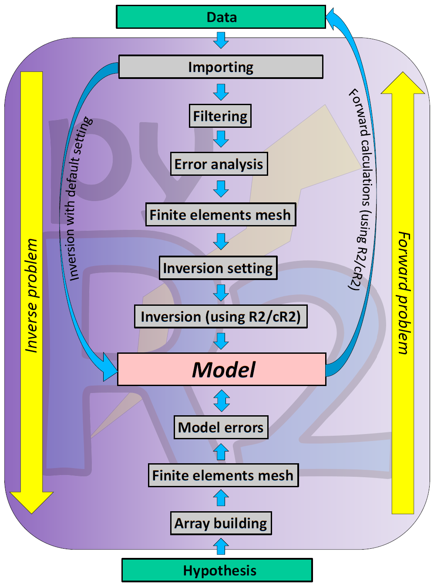
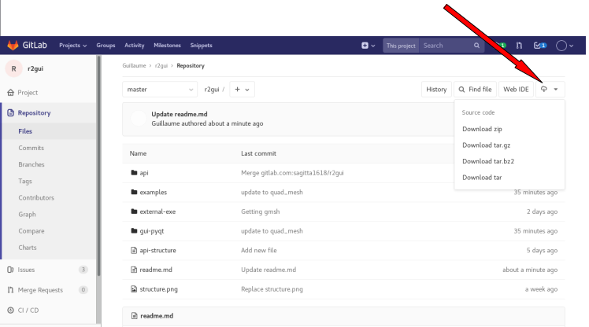

GUI for R2 family code
======================
(Note that **ResIPy** was called **pyR2** before 2019-04-16)

This python wrapper around the R2 family code (http://www.es.lancs.ac.uk/people/amb/Freeware/R2/R2.htm)
provides a standalone graphical user interface (GUI) along with a python API (Application Programming Interface)
for use in jupyter notebook. 

**Complete *help and documentation* can be viewed at: https://hkex.gitlab.io/pyr2**.


ResIPy aims to be 
- (1) **simple and intuitive** to use (you can invert your data in one-click with all default settings)
- (2) but still allowing the user to have **full control** on data filtering, error modelling, mesh parameters and inversion settings


ResIPy is an open-source project, everyone is welcome to contribute.

You can download the latest versions using the links below:

[](https://lancaster.box.com/s/3uvyrwxaurc87vkuxcz32bqzst0ujwsu)
[](https://lancaster.box.com/s/gafj2hqq3l94boff7hburb2mizb5v32e)
[](https://lancaster.box.com/s/vmezt50g0it4ml6x1iyy98sk06757ktm "Tested on Debian10 and Ubuntu18.04.2")

Notes that Mac and Linux:
- you will need to have *wine* installed as the executable beneath are compiled for Windows
- if you get a 'command not found' error, you might need to allow executable permission to the binary using `sudo chmod 775 ResIPy`


What it can do
--------------

<figcaption>General workflow available</figcaption>


<figcaption>Importing data and plotting pseudo-section. Note that there are option for borehole survey, time-lapse, batch and IP data.</figcaption>


<figcaption>Fitting a power-law error model for DC resistivity.</figcaption>


<figcaption>Creating a triangular mesh.</figcaption>


<figcaption>Tweaking fine inversion settings.</figcaption>


<figcaption>Inverting and plotting inverted section with different attributes.</figcaption>


More examples can be found in [examples](./examples/)


Project structure
-----------------

*General overlook of the project structure with the three main parts.*
Don't hesitate to consult the [api-structure.md](https://gitlab.com/sagitta1618/r2gui/blob/master/api-structure.md) for more detailed information about each file of the project.


The full description of the API can be found in the *[documentation](https://hkex.gitlab.io/pyr2/)*.


Download/Clone the project
-----
To clone the project please use git:

```
git clone https://gitlab.com/hkex/pyr2
```

You may need to generate a public ssh key to be able to fully use the git command line.

Another option is just to download the git from gitlab itself (see screenshot below):
*Download a zip of the project*


Try the GUI
-----------

To test the GUI:
```
cd pyr2/src
python ui.py
```
You can then test the GUI by first setting a working directory (./src/api/test) and specifying a survey file (./src/api/test/syscalFile.csv).
*Check out the tutorial with examples*: [pyR2-workshop.pdf](./examples/pyR2-workshop.pdf)


Try the Jupyter Notebook
------------------------
To start the Jupyter notebook:
```
cd pyr2/jupyter-notebook
jupyter notebook # the command is jupyter-notebook (with a dash) on Linux but without on Windows
```

You can then execute each cell of the notebook using ```Shift + Enter```. This will work on the same example as for the GUI above.
To edit a cell, just double click on it.


Linux and Mac users
-------------------
ResIPy contains executables that are built only for windows. To run them you will need to install *wine*.

### On Linux

```
sudo apt-get install wine
```

### On Mac

You first need to install ```wine``` through ```homebrew``` to be able to run ```.exe``` files on you Mac OS X:

Open "terminal" and install ```homebrew``` with:
```
ruby -e "$(curl -fsSL https://raw.githubusercontent.com/Homebrew/install/master/install)"
```
Follow the instructions. (You may need to install [Command Line Tools](http://osxdaily.com/2014/02/12/install-command-line-tools-mac-os-x/))

Once the ```homebrew``` installation is successfully done, install ```xquartz``` by below command in terminal:
```
brew cask install xquartz
```

Then install ```wine```:
```
brew install wine
```

If all is done with no errors, you are ready to run the gui by: 
```
cd pyr2/src
python ui.py
``` 
You also can run any ```.exe``` files by this command:
```
wine /your example.exe file directory/example.exe
```

**NOTE: the first time you're running ```wine``` it will need to be updated and that will take some time.


Features implementations/ bug report
----
If there is a feature you would like to see in the API or the GUI or if there is a bug you want to report,
 please raise an issue on Gitlab describing it. We need to **be able to reproduce** the issue in order to fix it, so please provide
 examples files and log related to your issue.
The issue will then be assigned to someone to be addressed. This will allow to spread the workload and avoid
two people doing the same work in parallel.


Best practices for developers
------------------------------

Here are a set of best coding practices that we need to respect in order to make a
simple, consistent and as easy to maintain as possible code:

- use **classes** to group functions inside the python API (for instance all functions dealing with meshes should be implemented inside a big Mesh class if possible)
- **document** functions : you can document your function directly in the code using the ReStructuredText convention (<link needed>) or just use comment with #
- **separation of API and GUI** should allow to use the python API in jupyter notebook as well as in standalone GUI using pyQt5


Use of git (for developers)
----------------------------

Below is the usual commands you are likely to go through if you contribute to this project.

First ensure you have cloned the project and are in the main project directory.
```bash
git clone https://gitlab.com/hkex/pyr2
cd pyr2
```
Second, you can either (1) create a new branch for your changes (recommended) or (2) use the default `develop` branch.
If you choose (1) you can create a new branch using:
```bash
git checkout -b <name_of_branch>
```

If you choose (2) make sure `develop` is ahead of `master` before changing anything. You can also use those instructions
to update your own branch with `master`.
```bash
git checkout develop # change to develop branch
git fetch origin # get all changes from master
git merge origin/master # merge those change to the develop branch
git push # push them to the online repository
```
 
Finally the typical workflow is as following:
1. Change branch: `git checkout <name_of_branch>`. You can see which branch you use by typing:`git branch`
2. Check you are up to date with the master branch (as shown above): `git fetch origin; git merge origin/master`
3. Operates your changes in the files
4. Use `git status` to see which file need to be added to the repository and which files have just been changed.
5. Use `git add newfile` to add new files.
6. Use `git commit -a` to add a commit messages to the changes you are about to push.
7. Use `git push origin <name_of_branch>` to push your changes to the repository.
8. Go on gitlab and on the project page you will see an invitation to create a merge
9. request from the branch you have just push to. You can also go to Repository > 
10. Branches and create a merge request from the `<name_of_branch>` branch.


Previous releases
-----------------
Below are the link to previous releases of ResIPy/pyR2. Note that those release can contains bugs and it is recommended to always use
the latest release available.
- v1.1.6
[](https://lancaster.box.com/s/ehjsvimef3hgw88trb36s9huq4vclnr0)
[](https://lancaster.box.com/s/bdtpn23crfxwdblq85ukjn2dj8a3spn0)
[](https://lancaster.box.com/s/3guw8q4pn94jb7qasrrej4p6df7ooi77)
- v1.1.5
[](https://lancaster.box.com/s/pc3fd9w3bxgyjnx5darga8g57tp92047)
[](https://lancaster.box.com/s/odbaxm7dj2d645r9mbgogxkcq78jitov)
[](https://lancaster.box.com/s/b2tea7fmwyr4uja0pn25lprunnp4ndlv)


