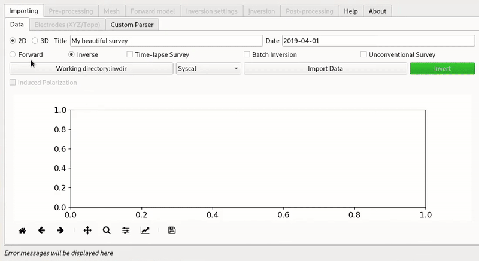

Getting Started
===============

ResIPy aims to process geoeletrical data (DC and IP). It provides a python application programming interface (API) and a standalone graphical user interface (GUI). Resipy provides high-level filtering, error modelling, inversion/forward modelling and post-processing tools.

    
    Animation of the workflow of creating synthetic data from forward modelling and then inverting them in the GUI.

The same processing can be achieved with the python API::

    from resipy import Project
    k = Project(typ='R2')
    k.createSurvey('examples/dc-2d/syscal.csv')
    k.invert() # invert measurements
    k.showResults() # display inverted pseudo-section

More examples are available in the Gallery of examples.

Installation
------------

The easiest way is to **download one of our standalone executable (.exe or .zip) from gitlab (https://gitlab.com/hkex/resipy)**.

If you wish to modify the code or just get the latest version, you can also *run from source* like this:

    git clone https://gitlab.com/hkex/resipy
    cd resipy/src
    python ui.py
    
Alternatively you can install the API part of the module (so no GUI) from pypi using pip::

    pip install resipy
    
    
.. note::
    Mac and Linux user will need *wine* to run the inversions.

