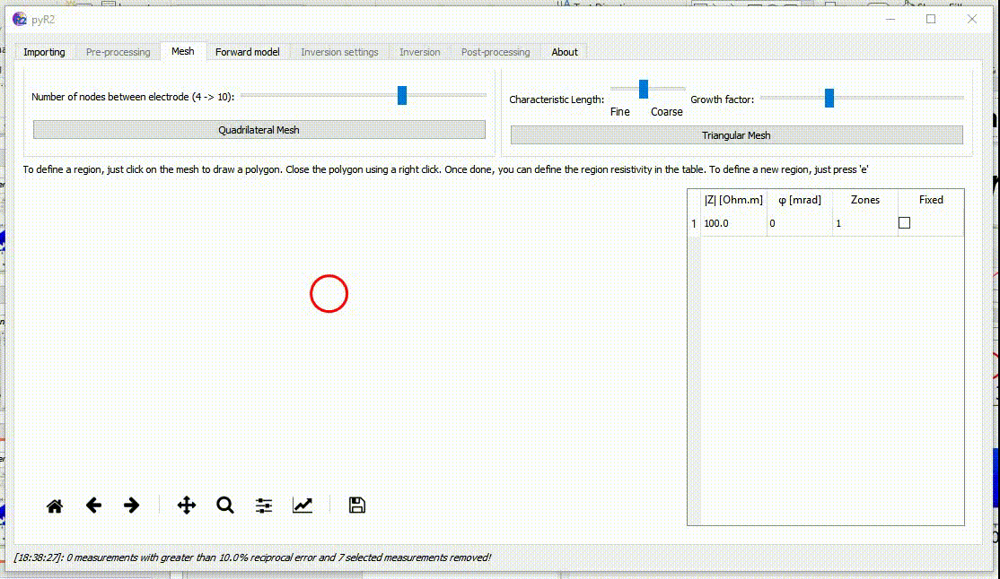
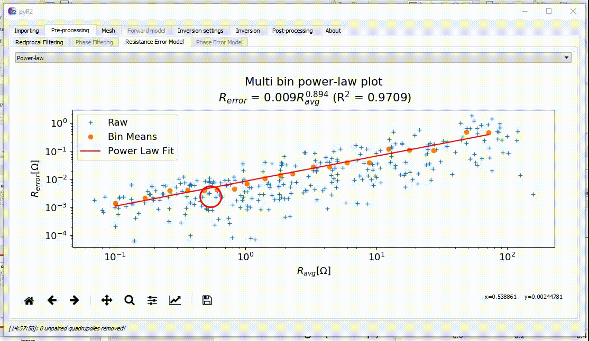
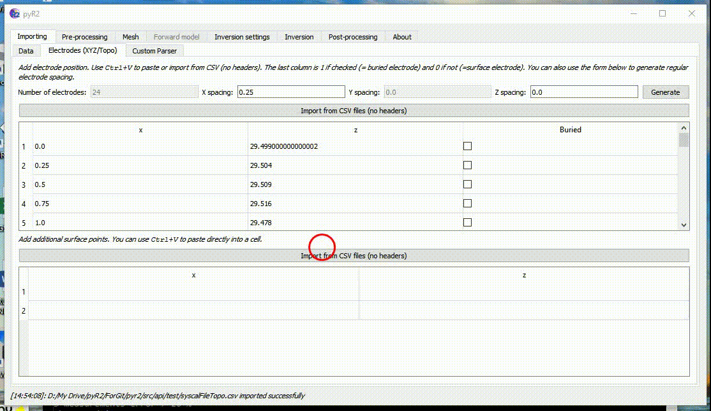
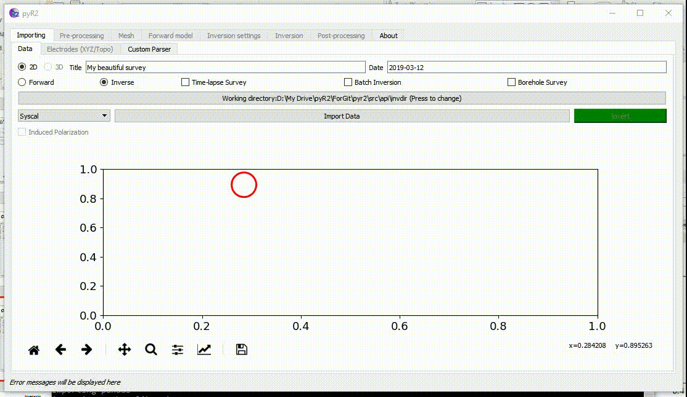
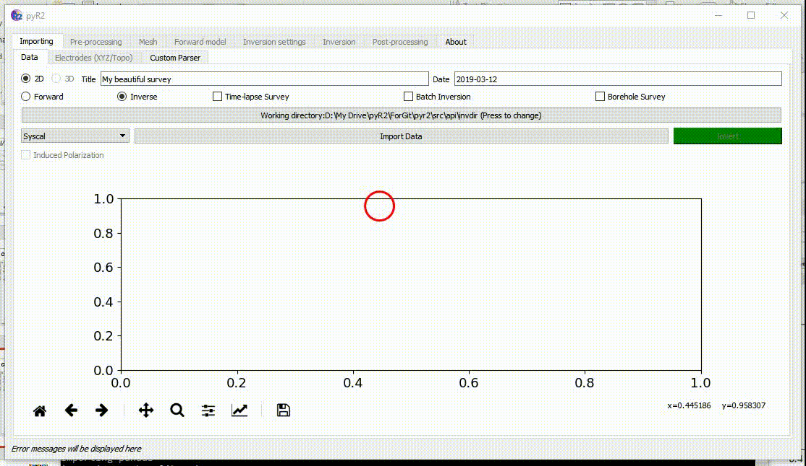
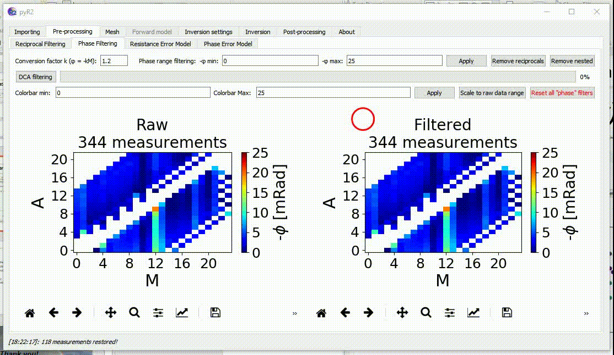
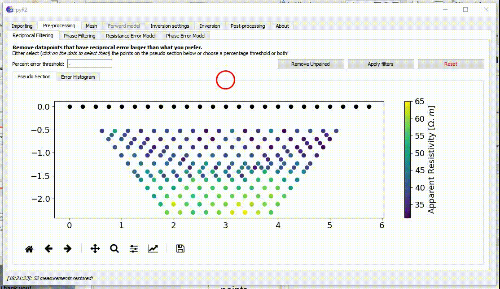
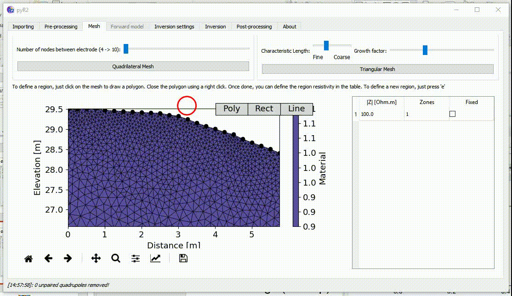
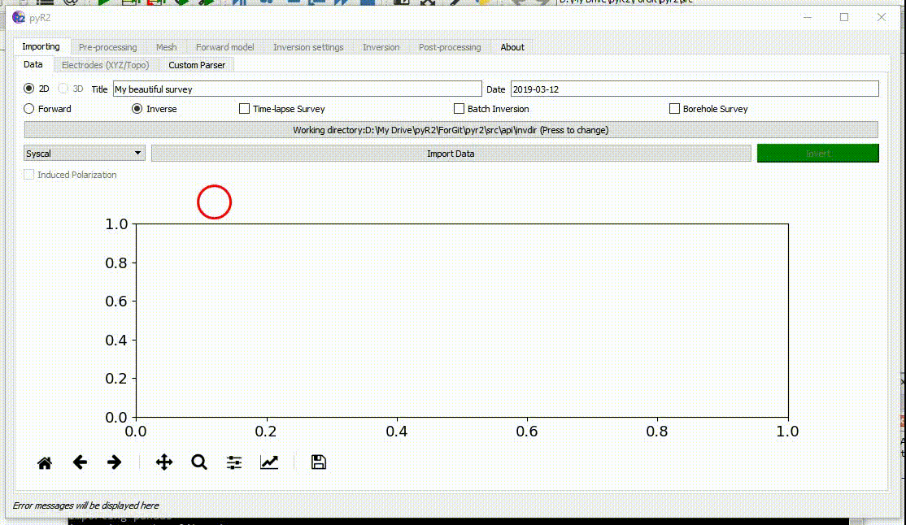
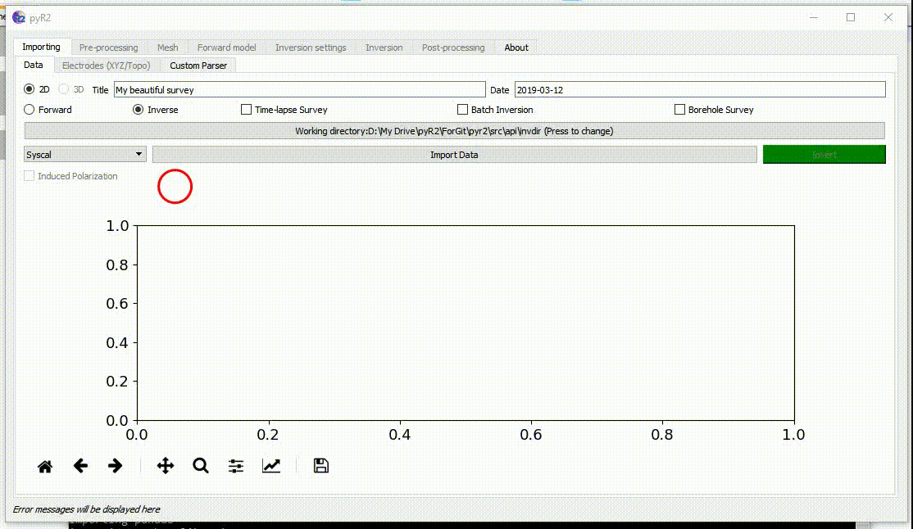

GUI in animated GIF
========================
On this page you will find several example of what can be done with the GUI as short animated GIF.

.. _importing:
.. figure:: image/Inv_import.gif

    Importing data. Different parsers are available. DC and IP data can be imported. A custom parser allows to parse in any file type.

.. _meshTopo:

    Creating a mesh (quadrilateral or triangular). Assigning regions of different shapes. Those regions can be fixed, be part of different zones (a zone is a region with a sharp boundary), have a specific starting resistivity and phase value. 

.. _mesh:

    When topography is supplied the quadrilateral and triangular mesh takes it into account automatically.

.. _preproc:

    Data pre-processing for DC data. Data can be filtered manually by selecting bad quadrupoles or/and specific electrodes. A resistance error model can then be fitted.
    
    
.. _timelapse:

    Time-Lapse processing and inversion.
    
    
.. _:xbh

    Inversion of cross-borehole data.
   

.. _phaseFilt:

    Filtering of IP (Phase) data using vmin/vmax, DCA filtering and other tools.
    

.. _recipFilt:

    Filtering based on reciprocal error.
    
    
.. _inversion:

    Inversion settings as well as results displayed.
    
    
.. _forward:

    Forward modelling on a flat surface.
    
    
.. _forwardTopo:

    Forward modelling with topography.
    
    
    
    
    
    
