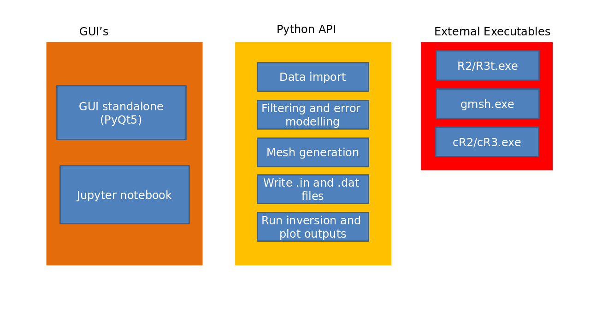

.. ResIPy documentation master file, created by
   sphinx-quickstart on Wed Aug 29 00:30:45 2018.
   You can adapt this file completely to your liking, but it should at least
   contain the root `toctree` directive.

ResIPy
======

ResIPy is a Python wrapper around the `R* family of codes <http://www.es.lancs.ac.uk/people/amb/Freeware/R2/R2.htm>`_ (for 2D/3D DC/IP inversion).
ResIPy provides a standalone graphical user interface (GUI) along with a Python API (Application Programming Interface)
for use in Jupyter notebook. Have a look at the :ref:`gallery_examples` or subscribe to our `YouTube channel (ResIPy) <https://www.youtube.com/channel/UCkg2drwtfaVAo_Tuyeg_z5Q>`_ to learn more.

ResIPy aims to be:

* **Simple and intuitive** to use (you can invert your data in one-click with all default settings)
* But still allowing the user to have **full control** on data filtering, error modelling, mesh parameters and inversion settings

What it can do
--------------

.. figure:: ../src/image/teaser3D.gif
   :alt: Animated gif of the GUI in action 3D

.. figure:: ../src/image/teaser2D.gif
   :alt: Animated gif of the GUI in action 2D

The same processing can be achieved with the :ref:`python_api`::

    from resipy import Project
    k = Project(typ='R2')
    k.createSurvey('examples/dc-2d/syscal.csv')
    k.showPseudo() # show pseudo-section
    k.invert() # invert measurements
    k.showResults() # display inverted section

More examples are available in the :ref:`gallery_examples`.

Download
--------

.. important::
    The easiest way is to `download one of the standalone executables (.exe or .zip) from GitLab <https://gitlab.com/hkex/resipy>`_.

If you wish to modify the code or just get the latest version, you can also *run from source* like this:

    git clone https://gitlab.com/hkex/resipy
    cd resipy/src
    python ui.py
    
Alternatively you can install the API part of the module (so no GUI) from pypi using pip::

    pip install resipy
    
    

Mac and Linux user will need *wine* to run the inversions. For more details please refer to the `GitLab <https://gitlab.com/hkex/resipy>`_.

Project structure
-----------------

General overlook of the project structure with the three main parts. Please refer to the GitLab if you want to contribute.

Contents
========

.. toctree::
   :maxdepth: 2
   
   gui
   gui-in-action
   gallery/index
   api
   

Indices and tables
==================

* :ref:`genindex`
* :ref:`modindex`
* :ref:`search`

   

Citing ResIPy
-------------
If you use ResIPy for you work, please cite this paper as:

Blanchy G., Saneiyan S., Boyd J., McLachlan P. and Binley A. 2020.
“ResIPy, an Intuitive Open Source Software for Complex  Geoelectrical Inversion/Modeling.”
Computers & Geosciences, February, 104423. https://doi.org/10.1016/j.cageo.2020.104423.

BibTex code::

    @article{blanchy_resipy_2020,
	    title = {{ResIPy}, an intuitive open source software for complex geoelectrical inversion/modeling},
	    issn = {0098-3004},
	    url = {http://www.sciencedirect.com/science/article/pii/S0098300419308192},
	    doi = {10.1016/j.cageo.2020.104423},
	    pages = {104423},
	    journaltitle = {Computers \& Geosciences},
	    author = {Blanchy, Guillaume and Saneiyan, Sina and Boyd, James and {McLachlan}, Paul and Binley, Andrew},
	    urldate = {2020-02-07},
	    date = {2020-02-04},
	    langid = {english}
    }
