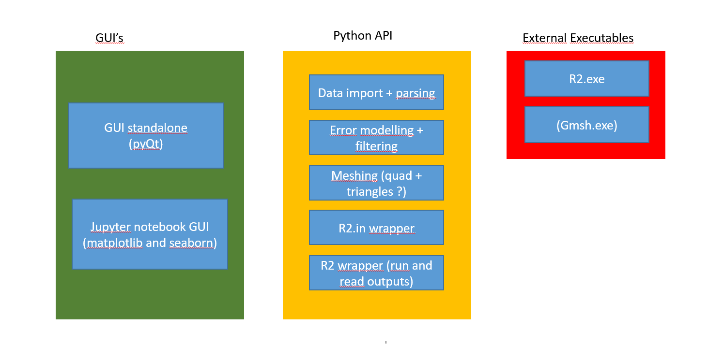

GUI for R2 family code
======================
This python wrapper around the R2 family code (http://www.es.lancs.ac.uk/people/amb/Freeware/R2/R2.htm)
provides a standalone graphical user interface (GUI) along with a python API* for use in jupyter notebook.

*API = Application Programming Interface


[**DOWNLOAD BINARY HERE**](https://lancaster.box.com/s/x7ke3i6ogmdkfobmbur6vttmxawjwjnh)
Note that Mac and Linux users need to have *wine* installed.


What it can do
--------------


Project structure
-----------------

*General overlook of the project structure with the three main parts.*
Don't hesitate to consult the [api-structure.md](https://gitlab.com/sagitta1618/r2gui/blob/master/api-structure.md) for more detailed information about each file of the project.


Download/Clone the project
-----
To clone the project please use git:

```
git clone https://gitlab.com/sagitta1618/r2gui.git
```

You may need to generate a public ssh key to be able to fully use the git command line.

Another option is just to download the git from gitlab itself (see screenshot below):
*Download a zip of the project*


Try the GUI
-----

To test the GUI:
```
cd r2gui
python ui.py
```
You can then test the GUI by first setting a working directory (./api/test) and specifying a survey file (./api/test/syscalFile.csv).
*Check out the tutorial with examples*: 


Linux and Mac user
---
pyR2 contains executables that are build only for windows. To run them you will need to install *wine*.

### On Linux


```
sudo apt-get install wine
```

### On Mac

You first need to install ```wine``` through ```homebrew``` to be able to run ```.exe``` files on you Mac OS X:

Open "terminal" and install ```homebrew``` with:
```
ruby -e "$(curl -fsSL https://raw.githubusercontent.com/Homebrew/install/master/install)"
```
Follow the instructions. (You may need to install [Command Line Tools](http://osxdaily.com/2014/02/12/install-command-line-tools-mac-os-x/))

Once the ```homebrew``` installation is successfully done, install ```xquartz``` by below command in terminal:
```
brew cask install xquartz
```

Then install ```wine```:
```
brew install wine
```

If all is done with no errors, you are ready to run the gui by: 
```
cd r2gui
python ui.py
``` 
You also can run any ```.exe``` files by this command:
```
wine /your example.exe file directory/example.exe
```

**NOTE: the first time you're running ```wine``` it will need to be updated and that will take some time.


Try the Jupyter Notebook
------------------------
To start the Jupyter notebook:
```
cd r2gui/examples/jupyter-notebook
jupyter notebook # the command is jupyter-notebook (with a dash) on Linux but without on Windows
```

You can then execute each cell of the notebook using ```Shift + Enter```. This will work on the same example as for the GUI above.
To edit a cell, just double click on it.


Best practices
--------------

Here are a set of best coding practices that we need to respect in order to make a
simple, consistent and as easy to maintain as possible code:

- use **classes** to group functions inside the python API (for instance all functions dealing with meshes should be implemented inside a big Mesh class if possible)
- **document** functions : you can document your function directly in the code using the ReStructuredText convention (<link needed>) or just use comment with #
- **separation of API and GUI** should allow to use the python API in jupyter notebook as well as in standalone GUI using pyQt5


Features implementations/ bug report
----
If there is a feature you would like to see in the API or the GUI or if there is a bug you want to report,
 please raise an issue on Gitlab describing it.
The issue will then be assigned to someone to be addressed. This will allow to spread the workload and avoid
two people doing the same work in parallel.


Use of git (for developers)
----------------------------

Below is the usual commands you are likely to go through if you contribute to this project.

First ensure you have cloned the project and are in the main project directory.
```bash
git clone git@gitlab.com:sagitta1618/r2gui.git
cd r2gui
```
Second, you can either (1) create a new branch for your changes (recommended) or (2) use the default `develop` branch.
If you choose (1) you can create a new branch using:
```bash
git checkout -b <name_of_branch>
```

If you choose (2) make sure `develop` is ahead of `master` before changing anything. You can also use those instructions
to update your own branch with `master`.
```bash
git checkout develop # change to develop branch
git fetch origin # get all changes from master
git merge origin/master # merge those change to the develop branch
git push # push them to the online repository
```
 
Finally the typicall workflow is as following:
1. Change branch: `git checkout <name_of_branch>`. You can see which branch you use by typing:`git branch`
2. Check you are up to date with the master branch (as shown above): `git fetch origin; git merge origin/master`
3. Operates your changes in the files
4. Use `git status` to see which file need to be added to the reposity and which files have just been changed.
5. Use `git add newfile` to add new files.
6. Use `git commit -a` to add a commit messages to the changes you are about to push.
7. Use `git push origin <name_of_branch>` to push your changes to the repository.
8. Go on gitlab and on the project page you will see an invitation to create a merge
9. request from the branch you have just push to. You can also go to Repository > 
10. Branches and create a merge request from the `<name_of_branch>` branch.


